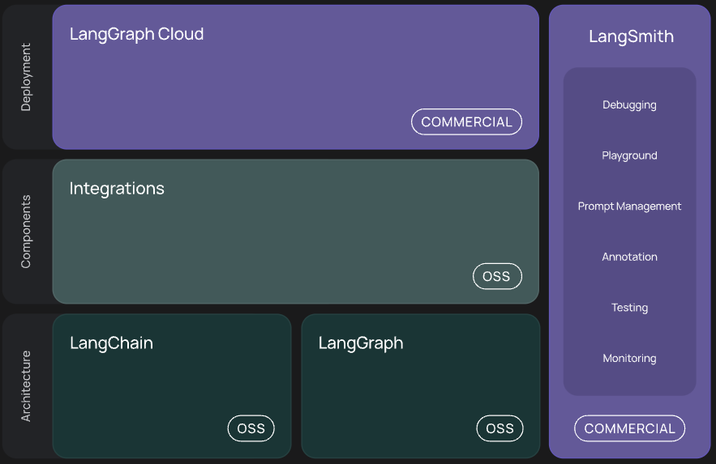

In this project, we learn about multiple parts of LangChain ecosystem.   



The parts that are introduced in this project are:  
1. LangChain  
2. LangSmith  
3. LangServe

The LLM models used are:  
1. OpenAI gpt-3.5-turbo
2. llama2 via Ollama integration

### Environment setup

```
## create conda virtual environment
conda create -n chatbot_langchain_env python=3.10 -y

## activate virtual env
conda activate chatbot_langchain_env

## install all required packages from requirement
pip install -r requirements.txt
```

### Using OpenAI
In the project, [openai_tutorial.py](chatbot/openai_tutorial.py) file contains simple tutorial to use OpenAI LLM model gpt-3.5-turbo with Langchain and can be traced on [LangSmith UI](https://smith.langchain.com/). 

Step 1: In order to use OpenAI LLM models, you need to load money in OpenAI website and get an OPENAI API key. Based on the token size, the usage is calculated and it will be charged.   
Step 2: Along with `langchain_core` package, `langchain_openai` package is required.  
Step 3: In order to see the activity of the chatbot on Langsmith, LangSmith API key needs to be saved along with setting the variable `LANGCHAIN_TRACING_V2` to "true". 
Step 4: The streamlit client can be run using the command `streamlit run openai_tutorial.py`  

### Using Ollama
Ollama is a platform where multiple open source LLM models can be run directly on local machine. Refer [locallamma_tutorial.py](chatbot/locallamma_tutorial.py) file.

Step 1: Ollama needs to be downloaded from [link](https://ollama.com/).  
Step 2: After downloading Ollama on local machine, run the application and test on terminal if it is successfully installed ``` ollama --version ```.  
Step 3: Download the LLM model locally in Ollama. ``` ollama run llama2```.  
Step 4: In Langchain, to use Ollama, we need ```langchain_community``` package.   
Step 5: The streamlit client can be run using the command `streamlit run openai_tutorial.py`  

Note: It takes lots of time to get response from llama2 model based on the local machine configuration.  